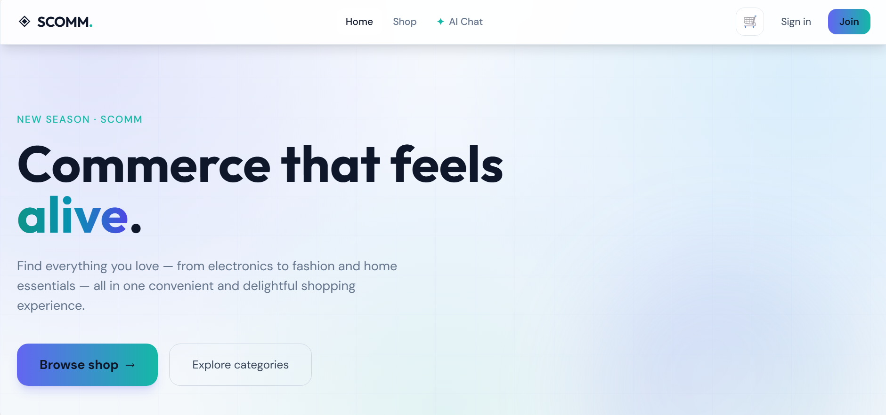
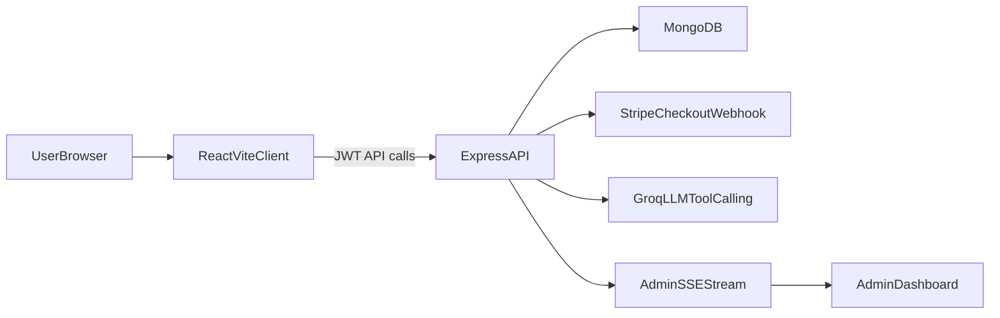

# SCOMM Store

SCOMM Store is a full-stack MERN commerce platform with an integrated AI agentic shopping assistant.  
The system combines transactional e-commerce workflows (catalog, cart, checkout, order tracking, admin operations) with a tool-calling LLM chat layer that can search products, inspect order context, and support checkout-oriented interactions.



## Project Structure

```text
SCOMM_Store/
├── client/              # React + Vite frontend application
├── server/              # Express + MongoDB API and business logic
├── docs/
│   └── images/          # README assets
├── package.json         # Monorepo scripts for local development
└── README.md            # Project-level documentation
```

## Key Capabilities

- JWT-based authentication and protected role-aware routes
- Product discovery, detail exploration, and cart-to-order flow
- Stripe-powered checkout session creation and webhook confirmation
- Admin operations for order management and product workflows
- Real-time admin notifications via SSE
- AI agentic chat assistant with tool-calling against live commerce data

## Technology Stack

| Layer | Technology |
| --- | --- |
| Frontend | React 19, Vite 6, React Router, Axios, Tailwind CSS, Framer Motion |
| Backend | Node.js, Express 5, MongoDB, Mongoose |
| AI Assistant | Groq SDK, tool-calling orchestration (`openai/gpt-oss-120b`) |
| Payments | Stripe Checkout + Stripe Webhooks |
| Authentication | JWT (Bearer token) |
| Realtime | Server-Sent Events (SSE) for admin notifications |
| Infra Utilities | Helmet, CORS, Rate Limiting, Nodemailer, Multer |

## End-to-End Workflow

### 1) Authentication and Session

1. User registers/logs in via client auth screens.
2. Backend issues JWT after successful login.
3. Frontend stores token and injects it into `Authorization` headers for protected calls.

### 2) Shopping and Order Lifecycle

1. User browses categories/products from `/api/products`.
2. Cart and checkout flow creates orders through `/api/orders`.
3. Admin can inspect and update order status through admin-protected endpoints.

### 3) Payment Lifecycle (Stripe)

1. Frontend requests checkout session via `/api/stripe/create-checkout-session`.
2. User completes Stripe checkout.
3. Webhook `/api/stripe/webhook` confirms payment and updates order state.

### 4) AI Agentic Chat Lifecycle

1. Authenticated user sends conversation history to `POST /api/chat`.
2. Backend chat controller invokes LLM with a tool schema (product search/details, order lookup, order creation).
3. Tool results are looped back into the model until final assistant output is produced.
4. Response returns:
   - assistant `message`
   - structured `products` for UI rendering
   - optional `checkoutUrl` when order flow requires it
5. Safety guardrail: order creation requires explicit confirmation intent from the user.

### 5) Admin Realtime Notifications

1. Admin client opens SSE stream at `/api/notifications/stream`.
2. Server pushes order-related notification events and heartbeat updates.
3. Admin UI keeps a live notification feed for operations monitoring.

## Architecture Snapshot



## Installation Overview

### 1) Install Dependencies

```bash
npm run install:all
```

### 2) Configure Environment Files

- `server/.env` for backend runtime, DB, auth, payment, and AI keys
- `client/.env.development` for frontend API base and dev proxy target

### 3) Run Full System

```bash
npm run dev
```

- Frontend: `http://localhost:5173`
- Backend: `http://localhost:<SERVER_PORT>` (defaults to `3002`)

## Useful Root Scripts

- `npm run install:all` - install server and client dependencies
- `npm run dev` - run server and client concurrently
- `npm run dev:server` - run backend only
- `npm run dev:client` - run frontend only
- `npm run build:client` - production build for client

## Important Engineering Notes

- Keep `CLIENT_URL` aligned with the actual frontend origin for CORS.
- Keep `VITE_DEV_API_ORIGIN` aligned with backend port for Vite proxy.
- Stripe webhook route must remain mounted before JSON body parsing.
- Backend serves image assets from `/images` mapped to `server/public/images`.
- Never commit production secrets; keep all sensitive values in `.env`.
